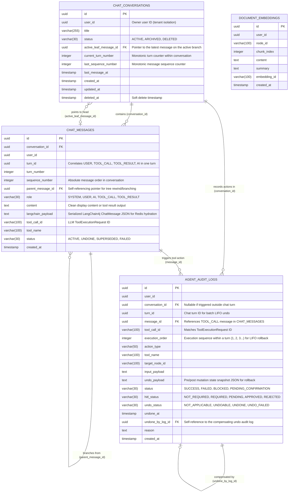

```mermaid
erDiagram
    CHAT_CONVERSATIONS {
        uuid id PK
        uuid user_id "Owner user ID (tenant isolation)"
        varchar(255) title
        varchar(30) status "ACTIVE, ARCHIVED, DELETED"
        uuid active_leaf_message_id FK "Pointer to the latest message on the active branch"
        integer current_turn_number "Monotonic turn counter within conversation"
        integer last_sequence_number "Monotonic message sequence counter"
        timestamp last_message_at
        timestamp created_at
        timestamp updated_at
        timestamp deleted_at "Soft delete timestamp"
    }

    CHAT_MESSAGES {
        uuid id PK
        uuid conversation_id FK
        uuid user_id
        uuid turn_id "Correlates USER, TOOL_CALL, TOOL_RESULT, AI in one turn"
        integer turn_number
        integer sequence_number "Absolute message order in conversation"
        uuid parent_message_id FK "Self-referencing pointer for tree rewind/branching"
        varchar(30) role "SYSTEM, USER, AI, TOOL_CALL, TOOL_RESULT"
        text content "Clean display content or tool result output"
        text langchain_payload "Serialized LangChain4j ChatMessage JSON for Redis hydration"
        varchar(100) tool_call_id "LLM ToolExecutionRequest ID"
        varchar(100) tool_name
        varchar(30) status "ACTIVE, UNDONE, SUPERSEDED, FAILED"
        timestamp created_at
    }

    AGENT_AUDIT_LOGS {
        uuid id PK
        uuid user_id
        uuid conversation_id FK "Nullable if triggered outside chat turn"
        uuid turn_id "Chat turn ID for batch LIFO undo"
        uuid message_id FK "References TOOL_CALL message in CHAT_MESSAGES"
        varchar(100) tool_call_id "Matches ToolExecutionRequest ID"
        integer execution_order "Execution sequence within a turn (1, 2, 3...) for LIFO rollback"
        varchar(50) action_type
        varchar(100) tool_name
        varchar(100) target_node_id
        text input_payload
        text undo_payload "Pre/post mutation state snapshot JSON for rollback"
        varchar(30) status "SUCCESS, FAILED, BLOCKED, PENDING_CONFIRMATION"
        varchar(30) hitl_status "NOT_REQUIRED, REQUIRED, PENDING, APPROVED, REJECTED"
        varchar(30) undo_status "NOT_APPLICABLE, UNDOABLE, UNDONE, UNDO_FAILED"
        timestamp undone_at
        uuid undone_by_log_id FK "Self-reference to the compensating undo audit log"
        text reason
        timestamp created_at
    }

    DOCUMENT_EMBEDDINGS {
        uuid id PK
        uuid user_id
        varchar(100) node_id
        integer chunk_index
        text content
        text summary
        varchar(100) embedding_id
        timestamp created_at
    }

    CHAT_CONVERSATIONS ||--o{ CHAT_MESSAGES : "contains (conversation_id)"
    CHAT_CONVERSATIONS }o--o| CHAT_MESSAGES : "points to head (active_leaf_message_id)"
    CHAT_MESSAGES ||--o{ CHAT_MESSAGES : "branches from (parent_message_id)"
    CHAT_CONVERSATIONS ||--o{ AGENT_AUDIT_LOGS : "records actions in (conversation_id)"
    CHAT_MESSAGES ||--o{ AGENT_AUDIT_LOGS : "triggers tool action (message_id)"
    AGENT_AUDIT_LOGS ||--o| AGENT_AUDIT_LOGS : "compensated by (undone_by_log_id)"
```
