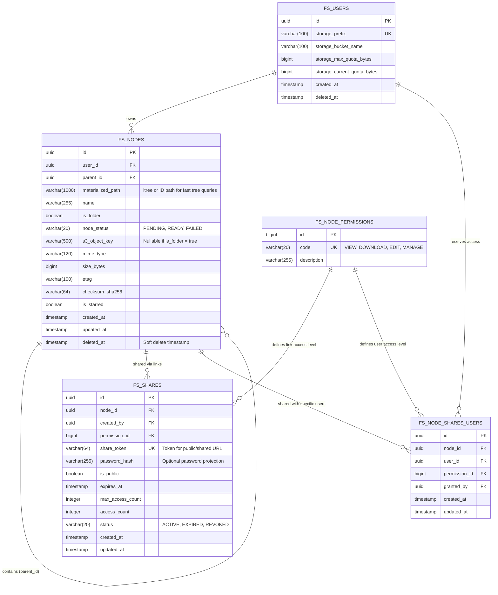

```mermaid
erDiagram
    FS_USERS {
        uuid id PK
        varchar(100) storage_prefix UK
        varchar(100) storage_bucket_name
        bigint storage_max_quota_bytes
        bigint storage_current_quota_bytes
        timestamp created_at
        timestamp deleted_at
    }

    FS_NODES {
        uuid id PK
        uuid user_id FK
        uuid parent_id FK
        varchar(1000) materialized_path "ltree or ID path for fast tree queries"
        varchar(255) name
        boolean is_folder
        varchar(20) node_status "PENDING, READY, FAILED"
        varchar(500) s3_object_key "Nullable if is_folder = true"
        varchar(120) mime_type
        bigint size_bytes
        varchar(100) etag
        varchar(64) checksum_sha256
        boolean is_starred
        timestamp created_at
        timestamp updated_at
        timestamp deleted_at "Soft delete timestamp"
    }

    FS_NODE_PERMISSIONS {
        bigint id PK
        varchar(20) code UK "VIEW, DOWNLOAD, EDIT, MANAGE"
        varchar(255) description
    }

    FS_SHARES {
        uuid id PK
        uuid node_id FK
        uuid created_by FK
        bigint permission_id FK
        varchar(64) share_token UK "Token for public/shared URL"
        varchar(255) password_hash "Optional password protection"
        boolean is_public
        timestamp expires_at
        integer max_access_count
        integer access_count
        varchar(20) status "ACTIVE, EXPIRED, REVOKED"
        timestamp created_at
        timestamp updated_at
    }

    FS_NODE_SHARES_USERS {
        uuid id PK
        uuid node_id FK
        uuid user_id FK
        bigint permission_id FK
        uuid granted_by FK
        timestamp created_at
        timestamp updated_at
    }

    FS_USERS ||--o{ FS_NODES : "owns"
    FS_NODES ||--o{ FS_NODES : "contains (parent_id)"
    FS_NODES ||--o{ FS_SHARES : "shared via links"
    FS_NODES ||--o{ FS_NODE_SHARES_USERS : "shared with specific users"
    FS_NODE_PERMISSIONS ||--o{ FS_SHARES : "defines link access level"
    FS_NODE_PERMISSIONS ||--o{ FS_NODE_SHARES_USERS : "defines user access level"
    FS_USERS ||--o{ FS_NODE_SHARES_USERS : "receives access"
```
