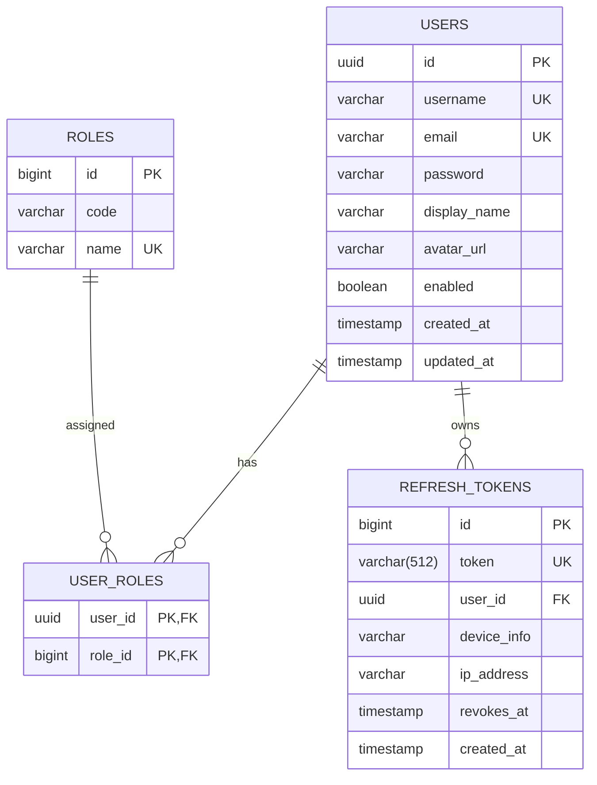

```mermaid

erDiagram
    USERS ||--o{ USER_ROLES : has
    ROLES ||--o{ USER_ROLES : assigned
    USERS ||--o{ REFRESH_TOKENS : owns

    USERS {
        uuid id PK
        varchar username UK
        varchar email UK
        varchar password
        varchar display_name
        varchar avatar_url
        boolean enabled
        timestamp created_at
        timestamp updated_at
    }

    ROLES {
        bigint id PK
        varchar code
        varchar name UK
    }

    USER_ROLES {
        uuid user_id PK, FK
        bigint role_id PK, FK
    }

    REFRESH_TOKENS {
        bigint id PK
        varchar(512) token UK
        uuid user_id FK
        varchar device_info
        varchar ip_address
        timestamp revokes_at
        timestamp created_at
    }
```
